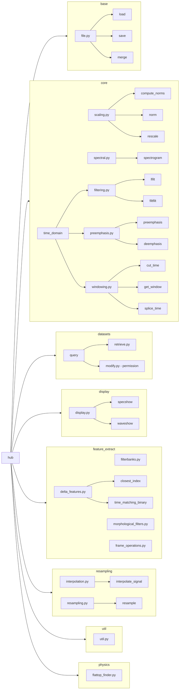

## Mermaid Diagram

```mermaid
graph LR
    
    A[hub]

    subgraph base
        direction LR

        A1[file.py]
        A1 --> B1[load]
        A1 --> B2[save]
        A1 --> B3[merge]
    end

    subgraph core
        direction LR

        A2[scaling.py]
        A2 --> B4[compute_norms]
        A2 --> B5[norm]
        A2 --> B6[rescale]

        A3[spectral.py]
        A3 --> B7[spectrogram]

        A4[time_domain]
        B8[filtering.py]
        B9[preemphasis.py]
        B10[windowing.py]
        A4 --> B8
        A4 --> B9
        A4 --> B10
        B8 --> C1[lfilt]
        B8 --> C2[filtfilt]
        B9 --> C3[preemphasis]
        B9 --> C4[deemphasis]
        B10 --> C5[cut_time]
        B10 --> C6[get_window]
        B10 --> C7[splice_time]
    end

    subgraph datasets
        direction LR

        A5[query]
        B11[retrieve.py]
        B12[modify.py - permission]
        A5 --> B11
        A5 --> B12
    end

    subgraph display
        direction LR

        A6[display.py]
        A6 --> B13[specshow]
        A6 --> B14[waveshow]
    end

    subgraph feature_extract
        direction LR

        A7[filterbanks.py]

        A8[morphological_filters.py]

        A9[frame_operations.py]

        A10[delta_features.py]
        A10 --> B30[closest_index]
        A10 --> B31[time_matching_binary]
    end

    subgraph resampling
        direction LR

        A2000[interpolation.py]
        A2000 --> B2000[interpolate_signal]

        A3000[resampling.py]
        A3000 --> B3000[resample]
    end

    subgraph util
        direction LR

        A4000[util.py]
    end

    subgraph physics
        direction LR

        A41[flattop_finder.py]
    end

    A --> base
    A --> core
    A --> datasets
    A --> display
    A --> feature_extract
    A --> resampling
    A --> util
    A --> physics
```
