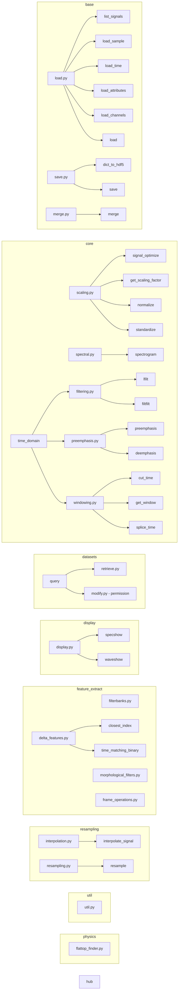

## Function Organization

```mermaid
graph LR
    subgraph physics
        direction LR
        A41[flattop_finder.py]
    end

    subgraph util
        direction LR
        A4000[util.py]
    end

    subgraph resampling
        direction LR
        A2000[interpolation.py]
        A2000 --> B2000[interpolate_signal]

        A3000[resampling.py]
        A3000 --> B3000[resample]
    end

    subgraph feature_extract
        direction LR
        A7[filterbanks.py]
        A8[morphological_filters.py]
        A9[frame_operations.py]
        A10[delta_features.py]
        A10 --> B30[closest_index]
        A10 --> B31[time_matching_binary]
    end

    subgraph display
        direction LR
        A6[display.py]
        A6 --> B13[specshow]
        A6 --> B14[waveshow]
    end

    subgraph datasets
        direction LR
        A5[query]
        B11[retrieve.py]
        B12[modify.py - permission]
        A5 --> B11
        A5 --> B12
    end

    subgraph core
        direction LR
        A2[scaling.py]
        A2 --> B4[signal_optimize]
        A2 --> B5[get_scaling_factor]
        A2 --> B6[normalize]
        A2 --> Ba[standardize]

        A3[spectral.py]
        A3 --> B7[spectrogram]

        A4[time_domain]
        B8[filtering.py]
        B9[preemphasis.py]
        B10[windowing.py]
        A4 --> B8
        A4 --> B9
        A4 --> B10
        B8 --> C1[lfilt]
        B8 --> C2[filtfilt]
        B9 --> C3[preemphasis]
        B9 --> C4[deemphasis]
        B10 --> C5[cut_time]
        B10 --> C6[get_window]
        B10 --> C7[splice_time]
    end

    subgraph base
        direction LR
        base1[load.py]
        base2[save.py]
        base3[merge.py]
        base1 --> base1a[list_signals]
        base1 --> base1b[load_sample]
        base1 --> base1c[load_time]
        base1 --> base1d[load_attributes]
        base1 --> base1e[load_channels]
        base1 --> base1f[load]
        base2 --> base2a[dict_to_hdf5]
        base2 --> base2b[save]
        base3 --> base3a[merge]
    end

    A[hub]
```
