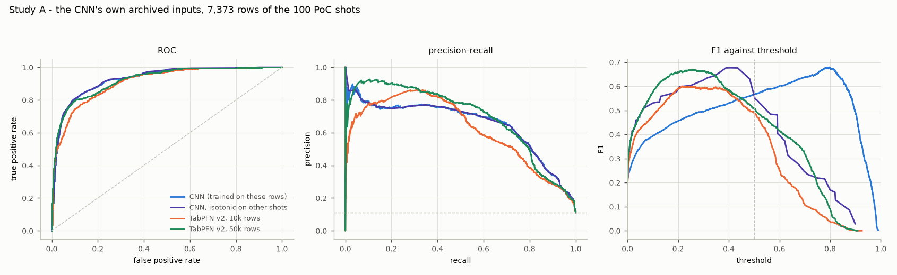
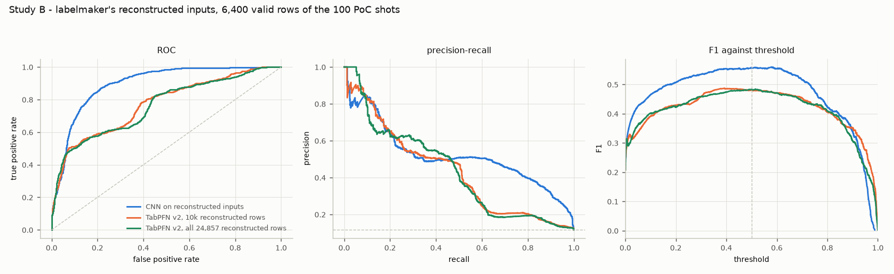

# TabPFN against the tearing CNN

Test rows are the 100 proof-of-concept shots. TabPFN never sees them; the CNN trained on
them, so its Study A numbers are a ceiling, not a fair opponent. TabPFN is version 2 (the
v2.5/v3 weights need a Prior Labs licence token). Made by scratchpad/tabpfn_report.py.

## Study A - archived (training) inputs

Test: 7373 rows, 100 shots, base rate 0.112.

| model | AUROC | AUPRC | F1 at 0.5 | best F1 (at) | ECE | train rows |
|---|---|---|---|---|---|---|
| CNN (ceiling) | 0.928 | 0.652 | 0.567 | 0.679 @ 0.80 | 0.129 | - |
| CNN + isotonic recalibration | 0.928 | 0.637 | 0.544 | 0.677 @ 0.41 | 0.032 | - |
| TabPFN v2, 10k rows | 0.910 | 0.615 | 0.488 | 0.600 @ 0.24 | 0.029 | 10000 |
| TabPFN v2, 50k rows | 0.923 | 0.691 | 0.507 | 0.669 @ 0.26 | 0.031 | 50000 |

betan RMSE: CNN 0.133, TabPFN regressor (10k) 0.090.

## Study B - labelmaker's reconstructed inputs

Train: 24857 valid rows from 371 shots; test: 6400 valid rows from 95 shots.

| model | AUROC | AUPRC | F1 at 0.5 | best F1 (at) | ECE | train rows |
|---|---|---|---|---|---|---|
| CNN on reconstructed inputs | 0.897 | 0.520 | 0.555 | 0.560 @ 0.58 | 0.073 | - |
| TabPFN v2, 10k reconstructed rows | 0.772 | 0.431 | 0.481 | 0.487 @ 0.39 | 0.092 | 10000 |
| TabPFN v2, all reconstructed rows | 0.762 | 0.434 | 0.484 | 0.484 @ 0.52 | 0.087 | 24857 |

betan RMSE on reconstructed inputs: CNN 0.149, TabPFN regressor (10k) 0.078.

